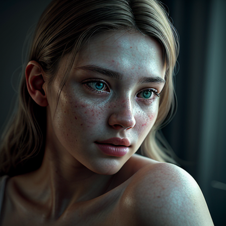

# 🌆 Photorealistic Portrait Test

**Prompt:**  
> photorealistic portrait of a young woman, soft lighting, 8k resolution, cinematic color grading, sharp focus, detailed skin texture

**Negative Prompt:**  
> low quality, blurry, distorted, overexposed, text, watermark, bad anatomy, lowres

---

### ⚙️ Settings
- **Model:** RealisticVisionV60B1_v51HyperVAE.safetensors  
- **Sampling method:** Euler a  
- **Sampling steps:** 15  
- **CFG Scale:** 6.5  
- **Resolution:** 448×448  
- **Hires.fix:** OFF  
- **Batch count:** 1  
- **Batch size:** 1  

---

### 🖼️ Generated Image

---

### 🧠 Notes
This image demonstrates that even on a **CPU-only setup (Ryzen 5 8600G)**, Stable Diffusion can produce highly detailed, realistic portraits using the **RealisticVision** model.  
The optimized configuration allowed for a fast render time with balanced lighting, sharp focus, and lifelike skin texture.

The test confirms:
- Proper CPU utilization and model loading  
- Stable rendering pipeline  
- Effective parameter tuning for realism and speed
